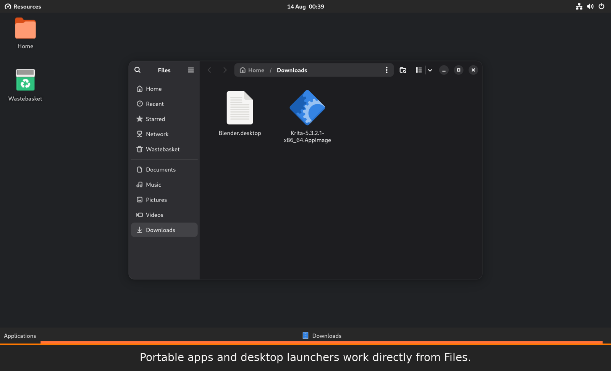

# Gnozzard



<sub><em>Gnozzard is not affiliated with or endorsed by upstream projects such as <a href="https://salsa.debian.org/gnome-team" target="_blank" rel="noopener noreferrer">Debian GNOME</a>, <a href="https://ubuntu.com/" target="_blank" rel="noopener noreferrer">Ubuntu</a>, <a href="https://gitlab.gnome.org/GNOME/gnome-shell" target="_blank" rel="noopener noreferrer">GNOME Shell</a>, <a href="https://github.com/nokyan/resources" target="_blank" rel="noopener noreferrer">Resources</a>, <a href="https://gitlab.gnome.org/GNOME/nautilus" target="_blank" rel="noopener noreferrer">Nautilus</a>, <a href="https://projects.blender.org/blender/blender" target="_blank" rel="noopener noreferrer">Blender</a>, or <a href="https://invent.kde.org/graphics/krita" target="_blank" rel="noopener noreferrer">Krita</a>. Applications are shown only to demonstrate desktop and application-menu functionality.</em></sub>

Gnozzard is a simple classic GNOME desktop extension for Debian\* 13+ and
Ubuntu\* 24.04/26.04+, with native support for portable applications and
AppImages. It is designed for the standard GNOME desktop and assumes that
Nautilus is the file manager.

The panel provides:

- a tall, upward-opening, scrollable Applications menu;
- pinned applications at the menu's bottom edge;
- one task button per window (never grouped), with capped widths by default and per-display 5-window paging when a taskbar is full;
- click-to-focus/minimise task buttons;
- task-button actions for graceful Close and red Force Kill;
- drag-to-reorder task buttons with one shared order on every monitor;
- the same complete taskbar and open-window list on every connected monitor;
- a small, text-free Show Desktop button;
- application actions for pinning and creating desktop shortcuts;
- a native Gnozzard app for the extension, taskbars, tray icons and desktop items;
- one-workspace and minimise-button defaults while the extension is enabled.

Gnozzard brings a classic single-workspace desktop model to modern GNOME, with
one taskbar entry per window, a simple searchable application list, and
continued support for GNOME's top bar, system controls, and tray applications.

The `.deb` package also installs Desktop Icons NG, AppIndicator tray support,
the native Gnozzard app, native AppImage and portable application support,
AppImage MIME integration, and Nautilus actions for launching an AppImage or
adding it to Applications with one click. Local `.desktop` launchers can also
be added to Applications, while local `.deb` packages get a direct **Install
Debian Package…** action. The package includes a lightly adapted fork of the
GPL-3.0-or-later Resources 1.8.0 system monitor. It remains visibly named
**Resources**, but uses Gnozzard-specific internal IDs and executable names so
it can coexist with a distribution's stock `resources` package.

## Supported systems

The amd64 package is tested on Debian 13 with GNOME Shell 48, Ubuntu 24.04 LTS
with GNOME Shell 46, and Ubuntu 26.04 LTS with GNOME Shell 50. Its extension
metadata declares Shell 46–50 and the bundled Resources fork is built against
the libadwaita 1.5 baseline used by Ubuntu 24.04.

## Install the package

To download the newest published release and install it with APT in one
command, run:

```sh
wget -qO /tmp/gnozzard_amd64.deb https://github.com/openresearchtools/gnozzard/releases/latest/download/gnozzard_amd64.deb && sudo apt install /tmp/gnozzard_amd64.deb
```

APT installs any missing declared dependencies and leaves dependencies that
are already satisfied alone. Log out and back in after installation.

Alternatively, download `gnozzard_amd64.deb` from the GitHub Release and
install the local file:

```sh
sudo apt install ./gnozzard_amd64.deb
```

The session bootstrap enables Gnozzard, Desktop Icons NG and AppIndicator once
for each new user without replacing the rest of the GNOME top bar. On Ubuntu,
it disables Ubuntu Dock once so it does not duplicate Gnozzard's taskbar.
Later extension choices are preserved across logins.

## Repository layout

- `extension/` — GNOME Shell extension and settings schema
- `helper/` — AppImage launcher/registrar and desktop shortcut helper
- `integrations/nautilus/` — AppImage right-click actions
- `data/` — MIME, desktop, and session bootstrap integration
- `third_party/resources/` — pinned Resources v1.8.0 source
- `debian/` — Debian source package metadata

## License

This project is licensed under GPL-3.0-or-later. Third-party packages retain
their own licenses.
