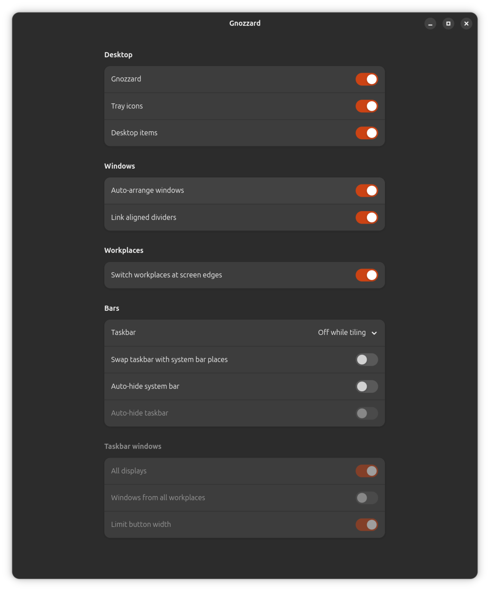

# Gnozzard


<sub><em>Gnozzard is not affiliated with or endorsed by upstream projects such as <a href="https://salsa.debian.org/gnome-team" target="_blank" rel="noopener noreferrer">Debian GNOME</a>, <a href="https://ubuntu.com/" target="_blank" rel="noopener noreferrer">Ubuntu</a>, <a href="https://gitlab.gnome.org/GNOME/gnome-shell" target="_blank" rel="noopener noreferrer">GNOME Shell</a>, <a href="https://github.com/nokyan/resources" target="_blank" rel="noopener noreferrer">Resources</a>, <a href="https://gitlab.gnome.org/GNOME/nautilus" target="_blank" rel="noopener noreferrer">Nautilus</a>, <a href="https://projects.blender.org/blender/blender" target="_blank" rel="noopener noreferrer">Blender</a>, or <a href="https://invent.kde.org/graphics/krita" target="_blank" rel="noopener noreferrer">Krita</a>. Applications are shown only to demonstrate desktop and application-menu functionality.</em></sub>

Gnozzard is an open-source classic GNOME desktop extension for Debian\* 13+
and Ubuntu\* 24.04/26.04+, with full optional auto-tiling, native workplaces,
and portable application and AppImage support. Its settings app gives you
12 desktop customisation controls, from window arrangement to taskbars and
screen-edge switching. It is designed for the standard GNOME desktop with
Nautilus as the file manager.

## Auto-tiling and desktop customisation

Turn on **Auto-arrange windows** to tile windows automatically in each
workplace. Drag windows to rearrange them into horizontal, vertical or mixed
layouts, and drag the dividers to give each window more or less space. New
windows join the layout; when there is not enough room, Gnozzard moves the
window to another workplace and switches there. Workplace management uses
GNOME's native workspaces.

The Gnozzard app has **12 customisation controls**, in addition to its main
on/off switch:

1. **Tray icons** — show application indicators.
2. **Desktop items** — show files and shortcuts on the desktop.
3. **Auto-arrange windows** — enable automatic tiling or keep free window placement.
4. **Link aligned dividers** — resize aligned splits together.
5. **Switch workplaces at screen edges** — move between existing workplaces at the left or right edge, without creating new ones.
6. **Taskbar** — turn it off while tiling, always show it, or never show it. When it is off, Applications moves to the system bar.
7. **Swap taskbar with system bar places** — exchange their top and bottom positions.
8. **Auto-hide system bar** — reveal it at its screen edge.
9. **Auto-hide taskbar** — reveal it at its screen edge.
10. **All displays** — show taskbars on every display.
11. **Windows from all workplaces** — include every workplace's windows or only the current one's.
12. **Limit button width** — keep taskbar buttons compact.

Auto-tiling and screen-edge workplace switching are optional and off by
default. Controls that do not apply to the current mode are disabled.



## Applications and taskbar

The panel provides:

- a tall, scrollable Applications menu that opens from its button on either bar;
- pinned applications at the menu's bottom edge;
- one task button per window (never grouped), with capped widths by default and per-display 5-window paging when a taskbar is full;
- click-to-focus task buttons, with minimising in free window mode;
- task-button actions for graceful Close and red Force Kill;
- task-button actions for moving a window to an existing or new workplace;
- drag-to-reorder task buttons with one shared order on every monitor;
- optional taskbars on every connected monitor;
- a small, text-free Show Desktop button;
- application actions for pinning and creating desktop shortcuts;
- a native Gnozzard app for the extension, taskbars, tray icons and desktop items;
- top-bar workplace buttons, with on-demand creation and native GNOME switching;
- an option to show the current workplace or every workplace on the taskbar;
- window-titlebar actions for moving to a workplace, creating a new one, and Force Kill.

Gnozzard brings a classic desktop model to modern GNOME, with one taskbar entry
per window, a simple searchable application list, native GNOME workspaces, and
continued support for GNOME's top bar, system controls, and tray applications.

The `gnozzard` package also installs Desktop Icons NG, AppIndicator tray support,
the native Gnozzard app, native AppImage and portable application support,
AppImage MIME integration, and Nautilus actions for launching an AppImage or
adding it to Applications with one click. Local `.desktop` launchers can also
be added to Applications, while local `.deb` packages get a direct **Install
Debian Package…** action. Its required `gnozzard-resources` companion package
contains the lightly adapted GPL-3.0-or-later Resources 1.8.0 system monitor.
It remains visibly named **Resources**, but uses Gnozzard-specific internal IDs
and executable names so it can coexist with a distribution's stock `resources`
package.

## Supported systems

Matching `gnozzard` and `gnozzard-resources` packages are published for amd64
and arm64. The amd64 packages are tested on
Debian 13 with GNOME Shell 48, Ubuntu 24.04 LTS with GNOME Shell 46, and Ubuntu
26.04 LTS with GNOME Shell 50. Its extension metadata declares Shell 46–50 and
the bundled Resources fork is built against the libadwaita 1.5 baseline used by
Ubuntu 24.04.

Some auto-tiling resize transitions on older GNOME versions are still being
validated.

## Install the package

For the first Open Research Tools installation on a system, this one command
adds the archive key and repository, refreshes APT, and installs Gnozzard:

```sh
wget -qO /tmp/keyring.deb https://keyring.openresearchtools.com && sudo apt install -y /tmp/keyring.deb && sudo apt update && sudo apt install -y gnozzard
```

If the Open Research Tools APT repository is already configured:

```sh
sudo apt install gnozzard
```

APT automatically selects both packages matching the system architecture and
installs `gnozzard-resources` with the desktop package. Each GitHub Release also
contains both packages for each supported architecture. Log out and back in
after installation.

GNOME reads the package's default extension set before it builds a new user's
desktop: Gnozzard, Desktop Icons NG and AppIndicator are enabled, while Ubuntu
Dock is disabled so it cannot duplicate Gnozzard's taskbar. Profiles with an
existing extension preference keep their own choices; no login-time process
rewrites extension state. For an existing profile that has different choices,
open Gnozzard once and enable Gnozzard, Desktop Icons and AppIndicator there;
disable Ubuntu Dock in the same window if it still appears.

## Repository layout

- `extension/` — GNOME Shell extension and settings schema
- `helper/` — AppImage launcher/registrar and desktop shortcut helper
- `integrations/nautilus/` — AppImage right-click actions
- `data/` — MIME, desktop, settings and GNOME default integration
- `third_party/resources/` — pinned Resources v1.8.0 source
- `debian/` — Debian source package metadata

## License

This project is licensed under GPL-3.0-or-later. Third-party packages retain
their own licenses.
